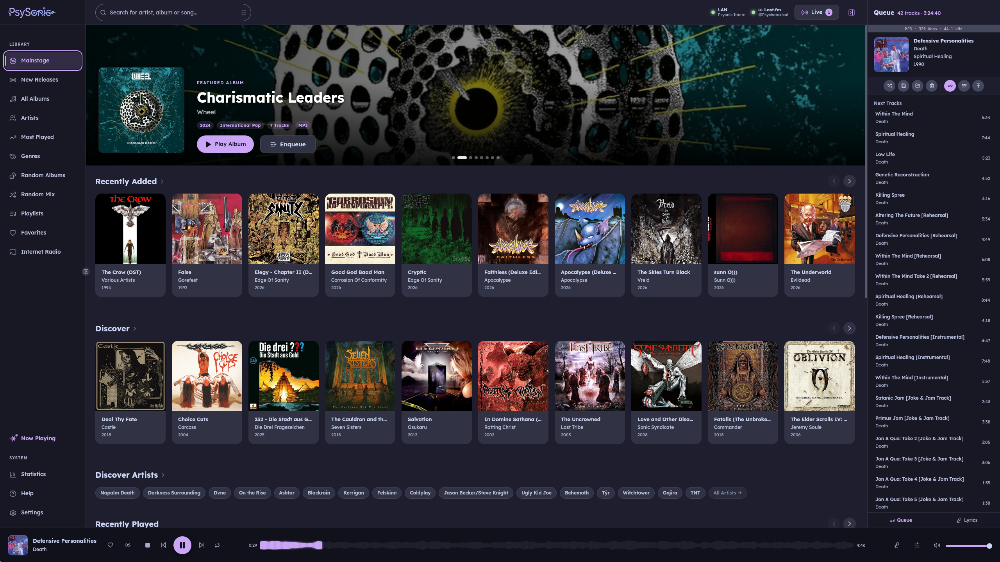

<div align="center">
  

  <p><strong>A modern, gorgeous, and blazing fast desktop client for Subsonic API compatible music servers (Navidrome, Gonic, etc.).</strong></p>
  
  <p>
    <a href="https://github.com/Psychotoxical/psysonic/releases/latest"></a>
    <a href="https://github.com/Psychotoxical/psysonic/blob/main/LICENSE"></a>
    <a href="https://tauri.app/"></a>
    <a href="https://aur.archlinux.org/packages/psysonic"></a>
    <a href="https://aur.archlinux.org/packages/psysonic-bin"></a>
    <a href="https://discord.gg/ckVPGPMS"></a>
  </p>
</div>

> [!WARNING]
> **Psysonic is under heavy active development.** Bugs and rough edges are to be expected. We reserve the right to change, remove, or rework existing features at any time without prior notice.

---

<div align="center">
  <a href="https://discord.gg/ckVPGPMS">
    
  </a>
  <p>Have questions, ideas, or just want to hang out? Come chat in our Discord server!</p>
</div>

---

Psysonic is a beautiful desktop music player built completely from the ground up for the modern era. Utilizing **Tauri v2** and **React**, it offers a native-feeling, lightweight, and incredibly fast experience with a stunning UI inspired by the [Catppuccin](https://github.com/catppuccin/catppuccin) and [Nord](https://www.nordtheme.com/) aesthetics.

Designed specifically for users hosting their own music via Navidrome or other Subsonic API servers, Psysonic aims to be the best way to interact with your personal library.




## ✨ Features

- 🎨 **Gorgeous UI**: 67 beautiful themes across 8 groups — Open Source Classics (Catppuccin, Nord, Gruvbox, Nightfox, Dracula), Operating Systems, Games, Movies, Series, Social Media, Psysonic originals, and Mediaplayer — with smooth glassmorphism effects and micro-animations. A time-based **Theme Scheduler** can automatically switch between a day and night theme.
- ⚡ **Blazing Fast**: Built with Rust & Tauri — native audio engine (rodio), minimal RAM usage compared to typical Electron apps.
- 🌍 **Internationalization (i18n)**: Fully translated into English, German, French, Dutch, Chinese, Norwegian, and Russian.
- 📻 **Live "Now Playing"**: See what other users on your server are currently listening to in real-time.
- 🎵 **Last.fm Integration**: Direct scrobbling, Now Playing updates, love/unlove, Similar Artists, and top stats — no Navidrome configuration required.
- 🎤 **Synchronized Lyrics**: Lyrics pane in the sidebar and fullscreen player — powered by LRCLIB and your Navidrome server. Synced lyrics auto-scroll with line highlighting and click-to-seek; plain-text fallback for unsynced tracks.
- 📻 **Smart Radio**: Start a Radio session from any song or artist. Playback begins instantly from top local tracks while similar artist tracks (via Last.fm) load in the background. Radio queues reload proactively so sessions never run dry.
- ♾️ **Infinite Queue**: When the queue runs out with Repeat off, Psysonic silently appends more random tracks (optionally filtered by genre) so playback never stops. Auto-added tracks appear below a clear `— Auto —` divider.
- 🎛️ **10-Band Graphic EQ**: Built-in EQ with presets and the ability to save custom presets. **AutoEQ** support lets you load headphone correction profiles automatically.
- 🔀 **Gapless & Crossfade**: True gapless playback and configurable crossfade between tracks (mutually exclusive).
- 📻 **Internet Radio**: Built-in internet radio player — browse and play any ICY/HLS stream directly within Psysonic.
- ⭐ **Ratings**: Rate songs, albums, and artists with 1–5 stars via the context menu, player bar, or album detail view. Supports the OpenSubsonic ratings extension. Auto-rate-down songs you skip repeatedly (configurable threshold). Filter Random Mix and Random Albums by minimum star rating.
- 🖥️ **Fullscreen Player**: A dedicated fullscreen view with album art, animated lyrics overlay, and artist image — toggled with a single click.
- 📋 **Playlist Management**: Create, edit, rename, and delete playlists. Drag-and-drop track reordering, song search, and smart suggestions right inside the playlist view.
- 💾 **IndexedDB Caching**: Ultra-fast loading times with persistent IndexedDB image caching for cover art and artist images.
- 📀 **Album Downloads**: Support for downloading entire albums directly to your local machine.
- 💿 **Album & Artist Views**: Beautiful grid displays, multi-select album actions, and detailed artist pages with related albums.
- 〰️ **Multi-Style Seekbar**: 10 canvas-drawn seekbar styles — Waveform, Bar, Thick Bar, Segmented, Line+Dot, Neon, Pulse Wave, Particle Trail, Liquid Fill, and Retro Tape.
- 🎛️ **Queue Management**: Drag & drop reordering, shuffle, playlist saving/loading, and server-side queue synchronization.
- ⌨️ **Configurable Keybindings**: Rebind any playback action (play/pause, next, seek, volume…) directly in Settings.
- 🔤 **Font Picker & UI Scale**: 10 UI fonts and a global zoom slider (80–150%) to match your display and taste.
- 🎼 **Random Mix**: Generate a random playlist from your entire library. Filter by keyword or pick a Super Genre (Metal, Rock, Electronic, Jazz…) for a focused mix with progressive loading.
- 🏷️ **Genres**: Browse your entire library by genre — coloured cards sorted by album count with a dedicated album view per genre. Multi-select genre filter available on Albums, New Releases, and Random Albums pages.
- 🔔 **System Tray**: Minimize Psysonic to the system tray. Play/Pause, Prev, Next, and Show/Hide controls available from the tray icon.
- 💾 **Backup & Restore**: Export and import all your settings, themes, and server profiles in one click.
- 🔄 **In-App Auto-Update**: Checks for new releases on startup. macOS and Windows can install and relaunch directly in-app; Linux users get a link to the GitHub release page.
- 🖥️ **Cross-Platform**: Available natively for Windows, macOS, and Linux (Arch AUR, .deb, .rpm).

## 🗺️ Roadmap

### ✅ Completed
- [x] Native Rust/rodio audio engine (replaces Howler.js)
- [x] 10-band graphic EQ with built-in and custom presets
- [x] AutoEQ — automatic headphone correction profile loader
- [x] Crossfade between tracks
- [x] Replay Gain (track + album mode)
- [x] Gapless playback
- [x] Multi-style seekbar (10 styles: Waveform, Bar, Thick, Segmented, Line+Dot, Neon, Pulse Wave, Particle Trail, Liquid Fill, Retro Tape)
- [x] Last.fm scrobbling, Now Playing & love/unlove
- [x] Similar Artists via Last.fm, filtered to library
- [x] Statistics — Last.fm top charts, recent scrobbles, top-rated songs & artists
- [x] Synchronized lyrics via LRCLIB and Navidrome server (in-sidebar + fullscreen, auto-scroll, click-to-seek)
- [x] Smart Radio with proactive queue loading
- [x] Infinite Queue (random auto-fill when queue runs out)
- [x] OGG/Vorbis native playback
- [x] Internet Radio (ICY/HLS streams)
- [x] In-app auto-updater (macOS + Windows)
- [x] Multi-server support
- [x] IndexedDB image caching
- [x] Random Mix with server-native Genre Mix (top genres by song count, shuffleable)
- [x] Advanced Search (text + genre + year + result-type filters)
- [x] 67 themes across 8 groups: Open Source Classics, Operating Systems, Games, Movies, Series, Social Media, Psysonic originals, Mediaplayer
- [x] Time-based Theme Scheduler (auto day/night theme switching)
- [x] Internationalization (English, German, French, Dutch, Chinese, Norwegian, Russian)
- [x] AUR package (Arch / CachyOS)
- [x] Configurable keybindings
- [x] Font picker (10 UI fonts) + global UI scale slider
- [x] Playlist management (create, edit, delete, drag-and-drop reorder, suggestions)
- [x] Fullscreen player with synced lyrics overlay
- [x] System tray icon with playback controls
- [x] Song / Album / Artist ratings (1–5 stars, OpenSubsonic extension)
- [x] Auto-rate-down on repeated skips + minimum-rating filter for mixes
- [x] Album multi-select actions
- [x] Custom Linux titlebar
- [x] Backup & Restore (settings export/import)

### 📋 Planned
- [ ] Theme contrast & legibility audit — systematic review of text/background contrast ratios across all 67 themes
- [ ] Accessibility (a11y) — keyboard navigation, screen reader support, ARIA labels
- [ ] More languages

---

## 📥 Installation

Navigate to the [Releases](https://github.com/Psychotoxical/psysonic/releases) page and download the installer for your operating system.

### 🐧 Linux

**Quick Install (Recommended):**
```bash
curl -fsSL https://raw.githubusercontent.com/Psychotoxical/psysonic/main/scripts/install.sh | sudo bash
```

**Manual Installation:**
- **Ubuntu / Debian**: `.deb` from GitHub Releases
- **Fedora / RHEL**: `.rpm` from GitHub Releases

### 🍎 macOS

- **macOS**: `.dmg` (Universal or Apple Silicon)

> [!WARNING]
> **Gatekeeper Note:**
> Since the app is released without an Apple Developer certificate, macOS will block it by default. To bypass this, run the following command in the Terminal after moving the app to the Applications folder:
> ```sh
> xattr -cr /Applications/Psysonic.app
> ```

### 🪟 Windows

- **Windows**: `.exe` (NSIS installer)

> [!WARNING]
> **SmartScreen Note:**
> Windows SmartScreen might show a warning because the installer isn't signed with an expensive developer certificate. Click on **"More info"** and then **"Run anyway"**.

## 📦 Installation (Arch Linux / AUR)

Psysonic is available in the **AUR** in two versions. Choose the one that best fits your needs:

| Package | Type | Description |
| :--- | :--- | :--- |
| [**psysonic**](https://aur.archlinux.org/packages/psysonic) | **Source** | Builds from source using your system's native **WebKitGTK** (no bundled libs, no EGL/Mesa compatibility issues). |
| [**psysonic-bin**](https://aur.archlinux.org/packages/psysonic-bin) | **Binary** | Pre-compiled version for faster installation. |

> [!TIP]
> The AUR binary package is kindly provided and maintained by [**kilyabin**](https://github.com/kilyabin).

## 🚀 Getting Started

1. Download and install Psysonic.
2. Open the app and enter your Subsonic/Navidrome server details (URL, Username, Password).
3. If applicable, you can provide both an external URL and a local LAN IP. Psysonic allows you to quickly toggle between them in the Settings.
4. Enjoy your music!

## 🛠️ Development

If you want to build Psysonic from source or contribute to the project:

### Prerequisites
- [Node.js](https://nodejs.org/) (v18+)
- [Rust](https://www.rust-lang.org/) (v1.75+)
- **`cmake`** — required to compile the bundled libopus (Opus audio support). Install it before running `cargo build` or `npm run tauri:build`:
  - Linux: `sudo apt install cmake` / `sudo pacman -S cmake`
  - macOS: `brew install cmake`
  - Windows: [cmake.org/download](https://cmake.org/download/) or `winget install cmake`
- OS-specific build dependencies for Tauri (see the [Tauri prerequisites guide](https://tauri.app/v2/guides/getting-started/prerequisites)).

### Setup

```bash
# Clone the repository
git clone https://github.com/Psychotoxical/psysonic.git
cd psysonic

# Install node dependencies
npm install

# Run in development mode
npm run tauri:dev

# Build for production
npm run tauri:build
```

## 🤝 Contributing

Contributions are completely welcome! Whether it is translating the app into a new language, fixing a bug, or proposing a new feature.

1. Fork the Project
2. Create your Feature Branch (`git checkout -b feature/AmazingFeature`)
3. Commit your Changes (`git commit -m 'Add some AmazingFeature'`)
4. Push to the Branch (`git push origin feature/AmazingFeature`)
5. Open a Pull Request

## 📄 License

Distributed under the **GNU General Public License v3.0**. See `LICENSE` for more information.

This means: you are free to use, study, and modify Psysonic. If you distribute a modified version, you must release it under the same GPL v3 license and keep the original copyright notice intact. You may **not** incorporate this code into proprietary software.

## 🔒 Privacy

Psysonic contains no telemetry or analytics. All third-party integrations (Last.fm, LRCLIB, Discord) are opt-in. See [PRIVACY.md](PRIVACY.md) for full details.
